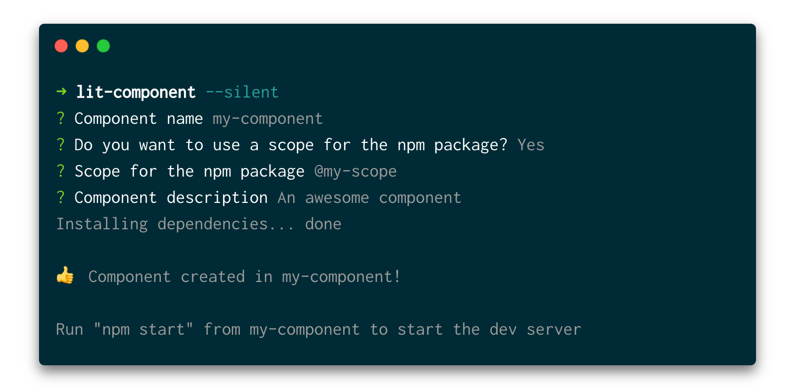

# LitElement Web Component generator

[](https://oclif.io)
[](https://parceljs.org/)

A minimal scaffold generator for Web Components with LitElement.

```sh
$ npm init kcmr/lit-component
```



Features:

- Uses [**Parcel** bundler](https://parceljs.org/) for the component's demo (dev server). **Super fast** build and reload!
- [@open-wc/testing](https://open-wc.org/testing/) for unit tests (TDD style)
- Allows to import the component class without element registration. Define the tag as you like

## Usage

Install it globally and run it:

```sh
$ npm i -g kcmr/lit-component
$ lit-component
```

Or run it directly without installation (get always the latest version from github):

```sh
$ npm init kcmr/lit-component
```

## Options

Component:
- `-n`, `--name` Component name
- `-d`, `--description` Component description (used in description field inside package.json)
- `-s`, `--scope` Optional package scope (`@my-company`)
- `-i`, `--[no-]install` Install dependencies (`true`). Use `--no-install` to skip dependency installation

CLI:
- `-h`, `--help` Shows the CLI help
- `-v`, `--version` Shows the CLI version

## Config files


